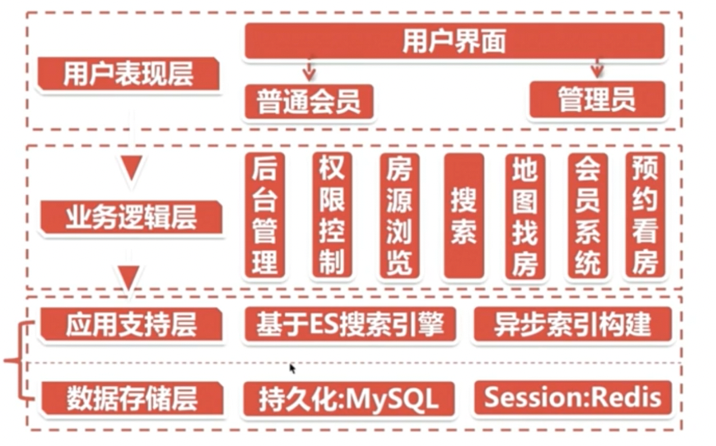
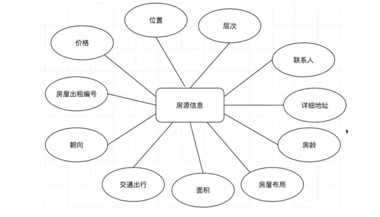
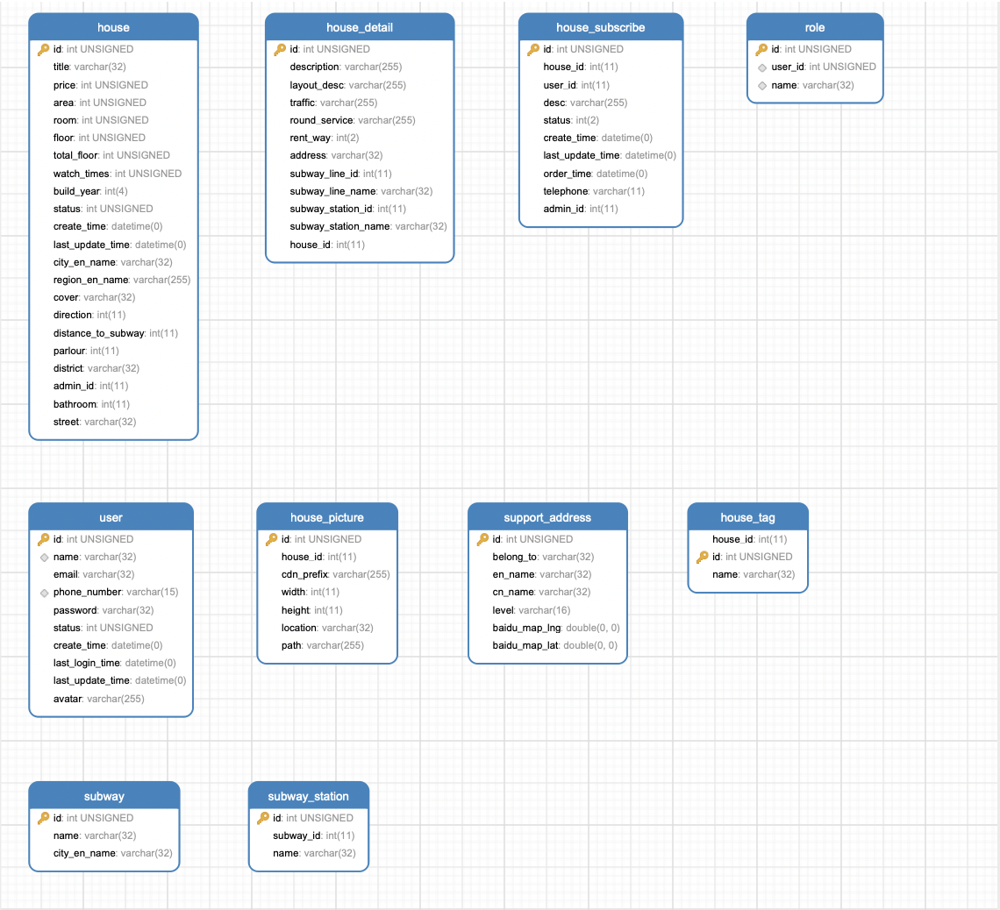

# elasticsearch-house
基于Elasticsearch的租房搜索系统

## 概述
### 系统架构
主要是以MySQL作为基础数据存储，结合ES实现站内搜索引擎。


### 涉及技术
- 核心搜索技术：
SpringBoot + Elasticsearch（方便实现站内搜索引擎）
- 站内搜索引擎实现：
Elasticsearch + MySQL + Kafka
- 地图搜索：
Elasticsearch + 百度地图
- 负载均衡，安全加固技术（监控报警）：
Elasticsearch + Nginx
- 日志数据分析技术：
ELK：Elasticsearch + Logstash + Kibana
- 数据库：
MySQL（其事务特性可做稳定的数据存储） + Spring Data JPA
- 前端框架：
thymeleaf（模版引擎技术，语法更接近HTML） + Bootstrap（前端开发框架） + JQuery
- 项目安全框架：
Spring Security（权限控制、自定义安全策略）
- 图片上传：
七牛云 + 百度开源框架webUpload
- 免注册登录：
阿里短信（基于阿里云通讯实现）

## 项目设计

### 数据库设计
#### ER图
实体-联系图(Entity Relationship Diagram)

- 用户ER图：


- 房源信息ER图

#### 数据库表对象模型



#### 结构
- 数据+结构转储sql
见文件：db/elasticsearch_house.sql

### 项目结构
#### 结构分层
经典的MVC架构：
- 1、表示层：web包
- 2、业务逻辑层：service包
- 3、数据层：entity包、repository包

#### API结构设计
##### RESTFul风格API：
<p> restful是一种软件架构风格、设计风格，而不是标准，只是提供了一组设计原则和约束条件。
它主要用于客户端和服务器交互类的软件。基于这个风格设计的软件可以更简洁，更有层次，更易于实现缓存等机制。
<p> REST（表现层状态转化），即Representational State Transfer的缩写。
它是一种互联网应用程序的API设计理念：URL定位资源，用HTTP动词（GET,POST,PUT,DELETE）描述操作。
<p> 统一资源接口：RESTFul架构应该遵循统一接口原则，统一接口包含了一组受限的预定义的操作，不论什么样的资源，都是通过使用相同的接口进行资源的访问。
接口应该使用标准的HTTP方法如GET，PUT和POST，并遵循这些方法的语义。

- RESTFul 的基本原理包括：
<p> 系统上的一切对象都要抽象为资源；
<p> 每个资源对应唯一的资源标识（URI）；
<p> 对资源的操作不能改变资源标识（URI）本身；
<p> 所有的操作都是无状态的等。

#####  API数据格式标准
- code：自定义请求状态码：
<p> 如`com.bubble.house.base.api.ApiStatus`定义的状态码信息；

- message：自定义请求响应信息描述：
如：`com.bubble.house.base.api.ApiResponse`

- data：当前API请求的目标数据；

##### 异常拦截器 
用于拦截项目运行中的无法预知的情况，通过统一拦截器进行异常拦截。
- 页面异常拦截器：
- API异常拦截器：

不让Springboot自动生成whitelabel页面，由我们自定义实现：`com.bubble.house.base.api.AppErrorController`
```yml
# 拦截器配置
server:
  error:
    whitelabel:
      # 进入SpringBoot框架自动生成whitelabel页面
      enabled: false
    path: /error
```

#### 